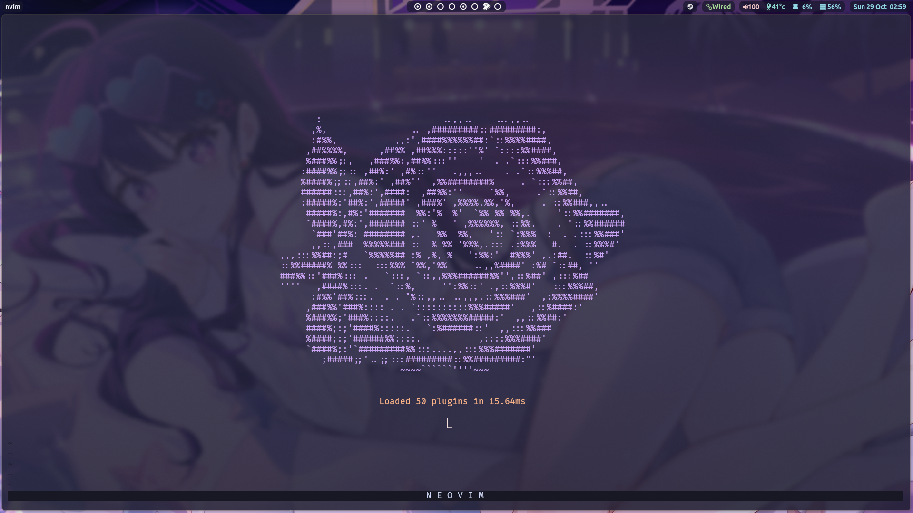

<h1 align="center">
    <br>
    My Neovim config
    <br>
</h1>



## About
My neovim config. Mostly stuff I've learned/stolen from other nvim users.
I'm doing my best to learn vim and use it as my main text editor and IDE.

## Installing:
Install wbthomason/packer.nvim
```shell
git clone --depth 1 https://github.com/wbthomason/packer.nvim\
 ~/.local/share/nvim/site/pack/packer/start/packer.nvim
```
Or just get the AUR package, whatever works..

Clone this repository into your $HOME.config folder and run `nvim +PackerSync`

Configure to your liking

PS: I use CAPSLOCK instead instead of Esc in vim. 
My CAPSLOCK key is bound to escape and the capslock function is bound to SHIFT+CAPSLOCK.
>/etc/X11/xorg.conf.d/00-keyboard.conf
```
Section "InputClass"
        Identifier "system-keyboard"
        MatchIsKeyboard "on"
        Option "Xkblayout" "us"
        Option "XkbOptions" "caps:escape_shifted_capslock"

EndSection
```
>hyprland.conf
```
input {
    kb_layout = us
    kb_options = caps:escape_shifted_capslock
}
```


## TODO
- [ ] god, i need a vertical monitor so bad
- [ ] tweak the  configs and change the keybinds
- [ ] actually learn vim, lmao

